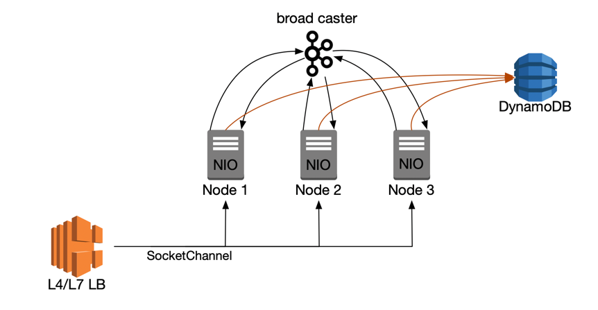

# Chat Engine Framework

<p>
Chat Engine Framework는 Java NIO 기반의 channel 통신 환경으로 채팅 시스템을 구축하기 위한 경량 프레임워크입니다.<br>
채팅룸의 참여 및 메시지 송수신 기능을 제공하며, (참여, 전송, 읽기, 쓰기 등) 이벤트를 변경하여 사용할 수 있습니다.
</p>

## 예상 인프라 아키텍처 예시


## 개요

ChattingEngine은 다음과 같은 기능을 중심으로 설계되었습니다:

* Non-blocking I/O 기반의 채팅 시스템 구축
* 채팅방의 참여/퇴장 및 시스템 메시지 발송 등을 이벤트 처리 방식으로 구현 및 확장 가능
* 다중 노드 환경 구성을 위한 메시지 브로드케스터 정의
* 메시지 Serialization 과 Deserialization을 확장하여 메시지 구성 가능하도록 설계

## 주요 구성 요소

### ChattingEngine

채팅 엔진의 진입점이며, 설정, 참여/퇴장, 리소스 초기화 등을 담당합니다.

#### 사용 예시

```java
ChatEngine chatEngine = new ChatEngine();
chatEngine.applyConfiguration(
        config -> config.port(9999)
);
chatEngine.start();
```

### ChattingEngineConfig

모든 설정을 구성하는 객체로, 람다 방식의 체이닝을 통해 Builder 없이 선언적으로 사용할 수 있습니다.

#### 주요 설정 항목

* `port(int)`: 서버 포트 설정
* `messageBroadCaster(MessageBroadCaster)`: 멀티노드간 메시지 브로드캐스팅 전략 설정
* `messageSender(MessageSender)`: 메시지 송신 전략 및 직렬화 설정
* `messageReceiver(MessageReceiver)`: 송신 수신 전략 및 역직렬화 설정
* `sendFilterPolicy(SendFilterPolicy...)`: 수신 대상 필터링 정책 설정
* `addMessageSubscriber(EventType, MessageSubscriber)`: 메시지 처리 정책 수정 및 확장

### SendFilterPolicy

수신 대상 소켓을 필터링하기 위한 인터페이스입니다. `and`, `or`, `negate` 등의 조합 메서드를 제공합니다.

```java
SendFilterPolicy onlyOthers = (receiver, sender) -> !receiver.equals(sender);
```

기본 제공 정책:

* `SendFilterPolicy.BroadcastExceptSelf`: 송신자 본인을 제외 (송신자 null 세팅 시 전체 대상)
* `SendFilterPolicy.NotConnected`: 연결된 소켓만 허용

### ~~InMemorySessionStore - Deprecated~~

~~채팅방 ID와 소켓 간의 관계를 저장하는 in-memory 저장소입니다.
옵션에 따라 `Socket → RoomId` 역방향 인덱스를 활성화할 수 있습니다.~~

### ~~ChatManager - Deprecated~~

* ~~`SendFilterPolicy` 기반 필터링~~
* ~~`MessageWriter<T>` 기반 직렬화~~
* ~~`ThreadPoolExecutor` 기반 비동기 처리~~
* ~~메시지 전송 후 `MessageBroadcaster` 실행~~

### ~~MessageWriter<T>~~

~~직렬화 전략을 정의하는 함수형 인터페이스입니다. OutputStream에 메시지를 기록합니다.~~

